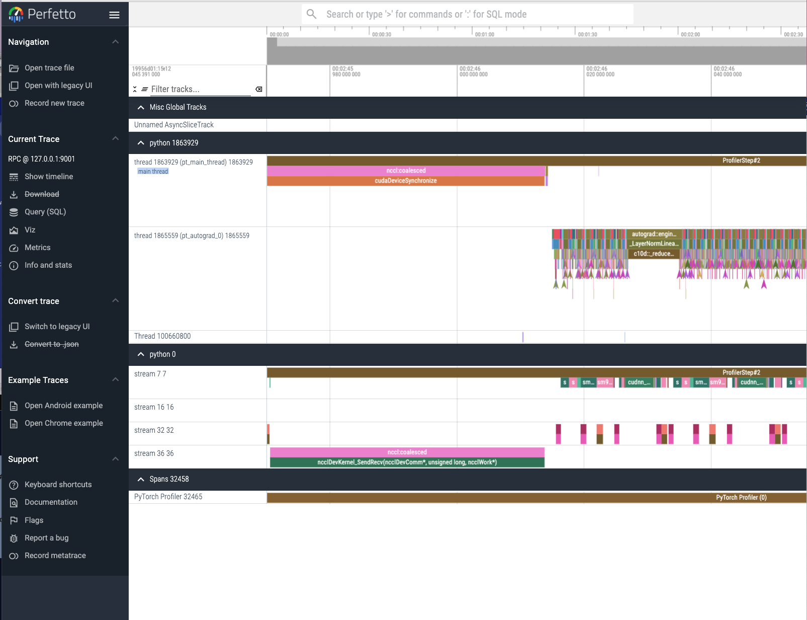

# PyTorch Profiler

Megatron-LMには、Timer機能によるprofile機能と、NSightによるprofile機能がdefaultサポートされています。
Timer機能によるprofileは、計算時間、通信時間を計測し、その推移をwandbに記録することができるように追加で修正を加えているため、非常に使いやすい機能です。しかし、Timer機能では通信と計算のoverlapがきちんとできているかなど、詳細なprofilingを行うことはできません。また、NSightによる計測は、Windowsまたは、Linuxのdesktopマシンなどが必要であるなど、profiling結果を可視化することが面倒です。

そこで、追加の機能としてPyTorch profilerによるprofilingをサポートしました。

```bash
  --tensorboard-dir ${TENSORBOARD_DIR} \
  --torch-profile \
  --torch-profile-wait 0 \
  --torch-profile-ranks 0 1 \
  --torch-profile-warmup 1 \
  --torch-profile-active 1 \
  --torch-profile-repeat 1 \
  --torch-profile-skip-first 1 \
  --torch-profile-with-flops \
  --torch-profile-profile-memory \
  --torch-profile-with-stack \
  --torch-profile-with-modules \
```

- `--tensorboard-dir`: ログの出力先になります
- `--torch-profile`: PyTorch profilerを有効にします
- `--torch-profile-wait`: profilerを開始するまで待つiteration数です
- `--torch-profile-ranks`: profilerを実行するrankのリストです (上では rank 0, 1を指定しています)
- `--torch-profile-warmup`: warmup iteration数です(この期間はprofilingされません)
- `--torch-profile-active`: profilerを実行するiteration数です(1 iteration で2GB程度になるので、1, 2 iteration程度にする方が良いでしょう)
- `--torch-profile-repeat`: profilerを繰り返す回数です

Profileが有効化されている場合、学習時のログに以下のようなものが出力されます。

```bash
STAGE:2024-08-21 10:15:12 1863929:1863929 ActivityProfilerController.cpp:314] Completed Stage: Warm Up
 [2024-08-21 10:19:42] iteration        4/   25000 | consumed samples:         4096 | elapsed time per iteration (ms): 270125.4 | throughput per GPU (TFLOP/s/GPU): 449.6 | iteration time: 270.125 s samples/sec: 3.8 | learning rate: 7.500000E-08 | global batch size:  1024 | lm loss: 2.120380E+00 | loss scale: 1.0 | grad norm: 14.218 | number of skipped iterations:   0 | number of nan iterations:   0 |
STAGE:2024-08-21 10:19:48 1863929:1863929 ActivityProfilerController.cpp:320] Completed Stage: Collection
STAGE:2024-08-21 10:19:52 1863929:1863929 ActivityProfilerController.cpp:324] Completed Stage: Post Processing
```

このように出力された後、Timeoutせずに次のiterationの学習に移行していれば、問題ありません。
吐き出すログが多すぎる場合、Timeoutしてしまう場合があります。適時NCCL timeoutの時間を調整するか、ログを減らすようにしてください。

ログがきちんと出力されている場合、`--tensorboard-dir`で指定したディレクトリに以下のようなファイルが出力されます。

```bash
events.out.tfevents.1724202278.r21n5.1863932.0
r21n5_1863929.1724203468009469317.pt.trace.json.gz
```

Tensorboardでは、2GBを超えるファイルを読み込む際に問題を引き起こすため、まず、ローカルにSFTPなどでファイルをダウンロードします。次に以下のコマンドで解凍します。

```bash
gunzip r21n5_1863929.1724203468009469317.pt.trace.json.gz
```

こちらをTensorboardやchrome://tracingで読み込みたいところですが、2GB以上あるprofileファイルを読み込もうとすると、多くの場合エラーが出る or そもそもprofile画面が表示されない等の現象が発生します。

これを回避するために以下のようにします。([参考](https://github.com/pytorch/kineto/issues/595))

可視化するためにPerfettoを利用します。
https://perfetto.dev/docs/visualization/large-traces のリンクにあるように環境を整えます。

```bash
curl -LO https://get.perfetto.dev/trace_processor
chmod +x ./trace_processor
 ./trace_processor --httpd r21n5_1863929.1724203468009469317.pt.trace.json
Downloading https://commondatastorage.googleapis.com/perfetto-luci-artifacts/v47.0/mac-arm64/trace_processor_shell
################################################################################################################################################################################################################################### 100.0%
Loading trace: 2668.49 MB

[079.646] processor_shell.cc:1658 Trace loaded: 2668.49 MB in 77.41s (34.5 MB/s)
[079.646]            httpd.cc:102 [HTTP] Starting RPC server on localhost:9001
[079.646]            httpd.cc:107 [HTTP] This server can be used by reloading https://ui.perfetto.dev and clicking on YES on the "Trace Processor native acceleration" dialog or through the Python API (see https://perfetto.dev/docs/analysis/trace-processor#python-api).
[101.731]       http_server.cc:83 [HTTP] New connection
[101.731]      http_server.cc:231 [HTTP] GET / [body=0B, origin=""]
[101.931]      http_server.cc:231 [HTTP] GET /favicon.ico [body=0B, origin=""]
```

のようになります。http://localhost:9001 にアクセスすると、以下のように表示されます。

```
Perfetto Trace Processor RPC Server


This service can be used in two ways:

1. Open or reload https://ui.perfetto.dev/

It will automatically try to connect and use the server on localhost:9001 when
available. Click YES when prompted to use Trace Processor Native Acceleration
in the UI dialog.
See https://perfetto.dev/docs/visualization/large-traces for more.


2. Python API.

Example: perfetto.TraceProcessor(addr='localhost:9001')
See https://perfetto.dev/docs/analysis/trace-processor#python-api for more.


For questions:
https://perfetto.dev/docs/contributing/getting-started#community
```

https://ui.perfetto.dev/ を開き、ダイアログに従うと以下のようになります。




w: Zoom in
s: Zoom out

で操作できます。

threadを見ることも有意義ですが、基本的に stream を見ることが多いでしょう。
